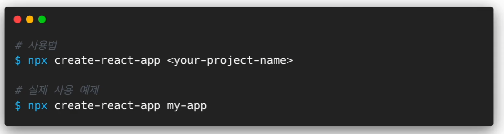

**CRA(create-react-app)**

**npx create-react-app test**

- **React 애플리케이션을 생성하기 위한 명령어**
- **`test`라는 이름의 새로운 React 프로젝트가 생성**

## 리엑트 생성

**명령어**

- **cd (경로 변경)**
- **npm start (애플리케이션 실행)**

.png>)